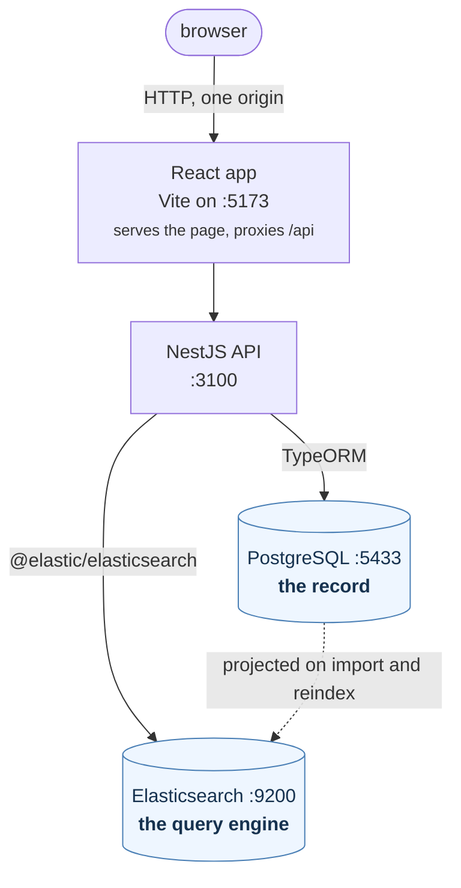

# LinkedIn profile search

Search and filter a LinkedIn profile export. Upload the file through the UI, review what the
importer made of it, then search the result.

## Running it

Two ways. The first does everything for you; the second is the same work, spelled out.

### Automatic

```bash
git clone https://github.com/sb2dev/linkedin-tools.git
cd linkedin-tools
./run.sh
```

That is the whole setup. It creates a private PostgreSQL in `.pgdata`, starts Elasticsearch in its
one container, installs both projects' dependencies, applies the migrations, creates the search
index, and runs the API and the app — printing the URLs when everything answers. Ctrl+C stops the
two servers. It is safe to re-run: every step checks what is already there first.

**Anything missing, it offers to install**, asking first and using the machine's own package manager
— apt, dnf, pacman or Homebrew. It also sets the one kernel setting Elasticsearch needs on Linux
(`vm.max_map_count`). `./run.sh --yes` installs without asking, for an unattended run. Logs go to
`.run/`.

| | |
|---|---|
| `./run.sh` | set everything up and run it |
| `./run.sh --yes` | the same, installing anything missing without asking |
| `./run.sh stop` | stop the servers, Elasticsearch and PostgreSQL too |
| `./run.sh reset` | stop, then delete the database and the search index |

Run it as yourself, not with `sudo`: it elevates only for the installs it was told to do, and root
would leave files behind that your own user cannot remove. It refuses to start as root.

| | |
|---|---|
| Linux | tested, and can install everything it needs |
| macOS | should work; installs through Homebrew, but Docker Desktop has to be opened once by hand. Not run there |
| Windows | through WSL2, where it behaves like Linux. Git Bash cannot run it, and the script says so |

**On Windows**, use WSL2 rather than Git Bash — Windows PostgreSQL has no unix sockets and Docker
Desktop needs WSL2 anyway:

```powershell
wsl -l -v                   # already have Ubuntu? skip the install; make sure it says VERSION 2
wsl --install -d Ubuntu     # otherwise: PowerShell as administrator, then reboot
```

Install Docker Desktop and turn on **Settings → Resources → WSL Integration → Ubuntu**. Then, inside
Ubuntu, clone into the Linux filesystem — not `/mnt/c` or `/mnt/d`, where npm is far slower, file
watching does not work, and PostgreSQL cannot hold the permissions it needs on its data directory:

```bash
cd ~ && git clone https://github.com/sb2dev/linkedin-tools.git
cd linkedin-tools && ./run.sh
```

The script installs Node and PostgreSQL itself once it is inside Ubuntu; only Docker Desktop is
installed on the Windows side.

### By hand

Needs Node 20+, PostgreSQL 14+ and Docker. On Debian or Ubuntu:

```bash
curl -fsSL https://deb.nodesource.com/setup_20.x | sudo -E bash - && sudo apt install -y nodejs
sudo apt install -y postgresql postgresql-client
curl -fsSL https://get.docker.com | sudo sh && sudo usermod -aG docker "$USER"   # then log out and back in
sudo sysctl -w vm.max_map_count=262144                                          # Elasticsearch will not boot without it
```

Then take the code:

```bash
git clone https://github.com/sb2dev/linkedin-tools.git && cd linkedin-tools
```

**1. PostgreSQL on 5433.** A private cluster beside whatever already holds 5432 — no root, no
service manager. Any PostgreSQL will do; point `DATABASE_*` in `backend/.env` at it instead.

```bash
initdb -D .pgdata -U linkedin --auth=trust        # from /usr/lib/postgresql/<version>/bin if it is not on PATH
pg_ctl -D .pgdata -o "-p 5433 -k /tmp" -l .pgdata/server.log start
createdb -h 127.0.0.1 -p 5433 -U linkedin linkedin
```

**2. Elasticsearch.** The one container; `docker-compose.yml` holds nothing else.

```bash
docker compose up -d --wait
```

**3. The API.**

```bash
cd backend
cp .env.example .env
npm install
npm run migration:run      # create the schema
npm run search:bootstrap   # create the search index
npm run start:dev          # http://localhost:3100/api
```

**4. The app**, in a second terminal.

```bash
cd frontend
npm install
npm run dev                # http://localhost:5173
```

To stop: Ctrl+C in both terminals, then `docker compose down` and `pg_ctl -D .pgdata stop`.

### Either way

| | |
|---|---|
| App | http://localhost:5173 |
| API | http://localhost:3100/api |
| API reference | http://localhost:3100/api/docs |
| Health | http://localhost:3100/api/health |

**Sign in as**

| | |
|---|---|
| Username | `admin` |
| Password | `admin` |

That one account is what the import and admin routes sit behind. It comes from
`ADMIN_USERNAME` and `ADMIN_PASSWORD_HASH` in `backend/.env` — the password is only ever stored as a
bcrypt hash, and the hash shipped in `backend/.env.example` is the hash of `admin`. It is a
development credential: the backend refuses to start under `NODE_ENV=production` while either that
hash or the example `JWT_SECRET` is still in place. To change it:

```bash
node -e "console.log(require('bcryptjs').hashSync('newpassword', 10))"   # paste into ADMIN_PASSWORD_HASH
```

The database starts empty and there is no seed step. Open the app, go to **Import**, sign in with
those credentials, and upload the export. You get a preview — counts, samples and rejected rows with
the reason — and nothing is written until you approve it.

The upload takes `.csv` or `.json`. The format is read from the bytes rather than from the
extension, so a file that is named wrong is still read for what it is. A JSON export is an array of
records — `[{ "full_name": "...", "linkedin_url": "..." }, …]`, or that array under one key of a
wrapper object. Records name their own columns, so they may carry them in any order and leave out
the ones they have nothing for.

**The dataset is not in this repository** and never will be: it is real personal data from a breach,
and `.gitignore` keeps it out. Whoever runs this needs the export file sent to them separately.

## Architecture



The browser only ever talks to one origin, so CORS never comes up: Vite serves the page and proxies
`/api` to the API. Neither the browser nor the frontend code reaches either store.

PostgreSQL holds every validated profile, the import runs and every rejected row. Elasticsearch
holds a flat projection of the queryable fields, built on import; contact details and coordinates
are stored but never indexed. Writes go to PostgreSQL first, then Elasticsearch. Reads never touch
PostgreSQL, and `npm run search:reindex` rebuilds the index from it.

The backend is two contexts — `profiles/` (search and read) and `imports/` (turn an export into
profiles) — each layered `interface/ → application/ → domain/`, with `infrastructure/` implementing
the ports the domain declares. The domain imports no framework.

The frontend keeps the whole search in the URL, so a result page can be shared and the back button
walks searches rather than keystrokes.

More detail in [documentation/architecture.md](documentation/architecture.md).

## Search and filters

The keyword box is one `multi_match` across names, titles, skills, companies, schools and bios, with
weights, so a name beats a passing mention in a bio. Fuzziness is on names and titles, where a typo
is likely, and off on skills, where "java" matching "javascript" would read as a bug. Past roles and
education are nested documents queried through `nested` clauses, so "manager at Garver" cannot be
satisfied by someone who was a manager somewhere and worked at Garver at another time.

Thirty-six filters, combining **OR within one filter, AND across filters**: two skills means either
skill, a skill plus a country means both. Filters sit in filter context, so they do not affect the
score. Sort by relevance, name, connections, experience or profile completeness.

Each filter's options carry counts from aggregations scoped to the current query. A filter's own
values are counted against the query minus that filter, otherwise picking one value would collapse
its own option list.

Which fields are filterable is data, not code: one entry in
`backend/src/profiles/domain/search/field-registry.ts` declares a field's type, its Elasticsearch
path and how it is shown. `GET /api/search/schema` serves that registry and the frontend renders
what it receives, so a new filter needs no frontend change.

## API

```
GET  /api/search?q=&sort=&page=&size=&facets=&f.<field>=<value>
GET  /api/search/schema                     the filter registry the frontend renders
GET  /api/search/suggest?field=&q=          prefix completion for high-cardinality fields
GET  /api/profiles/:username                contact details only with a token
POST /api/auth/login
POST /api/imports                    (auth, multipart "file", .csv or .json)   parse and report
GET  /api/imports    GET /api/imports/:id   GET /api/imports/:id/rows/:line     (auth)
POST /api/imports/:id/commit         (auth) { "repair": bool }  write what was previewed
GET  /api/admin/corpus               (auth) what the corpus holds
POST /api/admin/corpus/purge         (auth) { "confirm": "..." }  delete every profile
POST /api/admin/reindex              (auth) rebuild the index from Postgres
GET  /api/health
```

Filters are flat query parameters, one per field:

```
f.skills=leadership,training      any of these       (terms, ordered_terms)
f.yearsExperience=5..15           between, either end optional  (range)
f.graduationYear=2000..2010       between            (date_range)
f.hasGithub=true                  present / absent   (exists)
```

Values are URL-encoded individually, so a comma inside a value survives as `%2C` — which is how the
salary bands are sent. An unknown field, a malformed range or a non-numeric bound is a 400 naming
the parameter, never a silent drop. Every error is `application/problem+json`.

## Tests and lint

```bash
cd backend  && npm test && npm run lint   # 820 tests
cd frontend && npm test && npm run lint   # 663 tests
```

`npm run test:cov` on either side reports coverage and fails below 100% of statements, branches,
functions and lines, so a gap has to be closed rather than merged. Only the two entry points are
excluded, each named with its reason in the config: running them is running the program.

The backend's persistence, migration and schema-conformance specs need a real PostgreSQL. Each
creates and drops its own database, so nothing a developer has imported is ever the thing a test
truncates; with no server answering they skip rather than fail, and `npm test` still passes.

`frontend/src/test/contract.spec.ts` imports the backend's own field registry and filter parser —
the domain layer pulls in no framework, so it loads straight into Vitest — and round-trips the
frontend's URL encoding through the real parser. That is the one place the two sides can drift
without anything failing to compile.

## The dataset

The reference export is not clean: misaligned columns, rows destroyed by unescaped delimiters, and
fourteen columns that are Python `repr()` rather than JSON. 336 rows in, 265 distinct people out.
What the importer does about each defect is in
[documentation/architecture.md](documentation/architecture.md#the-import-pipeline).

`data/` holds it in both formats the upload accepts. `300 user linkedin.csv` is the export as it was
handed over — a comma-separated file that arrived under a `.txt` name. `300 user linkedin.json` is
the same dataset as records, written by `npm run dataset:json -- <source> <target>` in `backend/`.

The JSON holds 321 records where the CSV holds 336 rows, and still imports to the same 265 people,
identical down to the content hashes. Two things had to be settled to make that true, because a
record is keyed and a row is not: the twenty rows carrying a source-dump prefix are written with it
already stripped, or every column would key one place out, and the fifteen rows whose field count
the header does not match are left out, since the import refuses them in either format and a
truncated record would be accepted on values it never had.

The data is real personal information from a breach. It is not in this repository, and contact
details are masked in the UI behind an explicit reveal.
