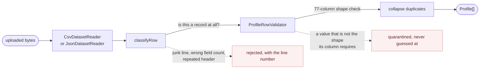

# Architecture

The [README](../README.md) covers how to run it and what the search does. This is what is behind
that: the layout of both sides, the data model, the import pipeline and the decisions that shaped
them.

## The backend

Two contexts, each with the same four layers. Dependencies point inwards only.

```
backend/src/
  profiles/                 searching and reading profiles
    domain/                 Profile, the field registry, search criteria, ports. No framework.
    application/            use cases
    infrastructure/         persistence/ (TypeORM)   search/ (Elasticsearch)
    interface/http/         controllers, DTOs, the filter query parser
  imports/                  turning an uploaded export into profiles
    domain/                 parsing/ and validation/, the ingestion pipeline. No framework.
    application/            preview, commit, list, purge
    infrastructure/         csv/ json/ persistence/
    interface/http/
  auth/                     one operator account, JWT; the same four layers, no infrastructure
  shared/                   config/ and cross-cutting HTTP (problem details, logging, health)
  scripts/                  bootstrap and reindex, run from npm rather than served
  migrations/
```

`domain/` imports nothing from Nest, TypeORM or the Elasticsearch client. That is why the search
logic and the validation rules are tested with no infrastructure at all, and why the frontend's
contract test can import the real field registry and filter parser instead of a copy of them.

Application code depends on ports; the container binds each to an adapter by symbol.

| Port | Adapter |
|---|---|
| `PROFILE_REPOSITORY` | `TypeormProfileRepository` |
| `PROFILE_SEARCH` | `ElasticsearchProfileSearch` |
| `IMPORT_SESSION_REPOSITORY` | `TypeormImportSessionRepository` |
| `DATASET_READER` | `SniffingDatasetReader` over `CsvDatasetReader` and `JsonDatasetReader` |

The last one is why nothing above the reader knows which of the two formats the export arrived in.
`SniffingDatasetReader` reads the first character that is not blank and delegates; the filename
never decides, so an export that is named wrong is still read for what it is.

## Two stores

PostgreSQL is the record. Three tables:

- **`profiles`** — one row per person, keyed on `linkedin_username`. Typed columns for the identity
  and facetable fields, `text[]` for skills, `jsonb` for the deep structures (experience, education,
  certifications, contacts), and `content_hash` over the normalised content, which is what makes an
  import new / updated / unchanged.
- **`import_sessions`** — one row per upload: its counts, its status, and the bytes, which a commit
  re-reads so it never trusts numbers computed during the preview. The bytes are released on commit.
- **`import_rejections`** — one row per refused source line, with its line number and reason.

Elasticsearch is the query engine. The document is a flat projection built by an allow-list, so
contact details, birth dates and coordinates live in PostgreSQL and are never indexed. The index
holds nothing unique: delete it and `npm run search:reindex` rebuilds it.

Writes go to PostgreSQL first, then Elasticsearch. There is no cross-store transaction, and that is
deliberate — a failed index run leaves the record intact and is repaired by a reindex, whereas the
reverse would lose data.

## The search index

`profiles/infrastructure/search/profile.mapping.ts` is the mapping. Two decisions carry most of it:

**Every facetable field is a keyword with a `.text` sub-field.** Aggregations and `terms` filters go
to the keyword; the free-text query goes to the analysed sub-field. One field serves both without
the registry having to say which.

**`experience` and `education` are `nested`, not `object`.** In an object field, "manager at Garver"
matches someone who was a manager somewhere and worked at Garver at another time, because the arrays
are flattened independently. Nested keeps each entry whole, and the query builder groups every
filter that shares a nested path into one `nested` clause so they must match the same entry.

`domain/search/field-registry.ts` is the single source of truth for what is filterable: key, label,
group, kind, Elasticsearch path, and whether it can be faceted or completed. `GET /api/search/schema`
serves it, `query-builder.ts` translates a filter only if it appears there, and the frontend renders
what it receives. Adding a filter is one entry.

Facets are computed under every filter *except their own* — a `global` aggregation with the rest of
the query re-applied inside it. Without that, ticking one value leaves it as the only bucket and no
second value can be picked. Counts on nested fields use `reverse_nested`, so three jobs at one
company count the person once.

## The import pipeline

`imports/domain/` is pure: no database, no cluster. That is what lets the commit path re-run it over
the stored bytes rather than trusting the preview.



Both readers hand up the same thing: a header, and rows of cells carrying the line they start on. A
JSON record names its own columns, so the header is the union of the keys in first-use order and a
missing key is an empty cell; from `classifyRow` onwards the two formats are indistinguishable,
except that a keyed record cannot have the wrong number of fields and so is never rejected for it.

`classifyRow` decides whether a line is a record at all. `ProfileRowValidator` walks the 77-column
catalog, coerces each cell against the shape that column is supposed to have, and records what it
dropped rather than guessing. A cell that fails is quarantined, never repaired field by field.

Some rows have a shifted multi-value block: five anchor columns detect it. When repair is requested,
`realignBlock` looks for one offset that makes **every** populated strongly-typed column in the block
valid; if no offset does, the row is left alone. Repair is opt-in and shown in the preview with a
before-and-after of a row it would fix, so the choice rests on evidence.

Change detection is the sha256 in `content_hash`. The export's `version_status` column looks like a
version signal but is a constant, so it is not used.

## The frontend

```
frontend/src/
  api/                    one fetch wrapper, one module per resource
  lib/query-state.ts      the URL codec
  hooks/                  use-search (the API), use-auth (the session)
  components/             filters/ results/ profile/ import/ layout/
  pages/                  SearchPage, ProfilePage, ImportPage
  types/api.ts            the shapes the API returns
```

Three kinds of state, deliberately kept apart.

**The search is the URL.** `lib/query-state.ts` is the only code that reads or writes it — `q`,
`sort`, `page`, `size`, and one `f.<key>=<value>` per filter. Nothing mirrors it into a store, so a
result page can be handed to someone else and the back button walks searches rather than keystrokes.
The backend parses the same grammar, and `test/contract.spec.ts` round-trips this codec through the
real parser, which is the one place the two sides could otherwise drift.

**Everything from the API belongs to TanStack Query.** Results, the schema, facets, suggestions and
the import preview are cached under a key built from that URL state, so changing a filter is a new
key rather than a manual refetch. A 4xx is the server's answer and is not retried; only transport
failures and 5xx are. No component keeps its own copy of a response.

**Zustand holds only the session** — token, operator name, whether a sign-in is in flight. It is
kept in `sessionStorage`, so the token dies with the tab, and it registers one handler with the
fetch wrapper so a 401 anywhere signs the reader out once.

`api/client.ts` is the only place that knows the base path, attaches the bearer token and turns a
`problem+json` body into an `ApiError`. Above it, the UI renders what the schema describes:
`FilterPopover` picks a control from each field's declared `kind`, so a new backend filter appears
in the interface without a change here.

## Auth

One operator account, held in configuration as a username and a bcrypt hash; the plaintext never
exists in the process. `POST /api/auth/login` returns a JWT. Reads are public. Imports, purge and
reindex require the token. `GET /api/profiles/:username` uses an optional guard: no token still
answers, but the `contact` block is only included for a caller that presented one.

Helmet sets the security headers, `class-validator` checks every DTO, uploads are capped by multer
and by the body parser, and the import, purge and source-row endpoints carry their own rate limits
on top of the global one.

Outside production the API also serves its own OpenAPI document at `/api/docs`. That is the one
concession in the header policy: the Swagger UI is inline script and style, so its content security
policy is relaxed only while the docs are mounted, and in production neither is.

## Errors

One exception filter turns everything into RFC 7807 `application/problem+json`. A validation failure
or a bad filter carries an `errors` member keyed by the parameter at fault, so the frontend can point
at the control that is wrong. An unexpected error is logged server-side and answered with a flat 500
— never a stack trace or an ORM message.
